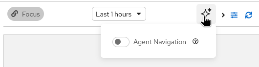

# AI Agent Navigation

> [!WARNING]
> **Dev Preview**: AI Agent navigation is a developer preview feature.
> It is not yet generally available (GA) and is not recommended for production use.
> The feature, its API, and its configuration are subject to change without notice.

The troubleshooting panel can allow an AI agent to navigate the console on your behalf, running correlation searches and explaining what you are looking at.

## Enabling the feature

AI Agent navigation is behind a feature gate. Edit the `troubleshooting-panel` UIPlugin and set `enableAgentNavigation: true`:

```yaml
apiVersion: observability.openshift.io/v1alpha1
kind: UIPlugin
metadata:
  name: troubleshooting-panel
spec:
  type: TroubleshootingPanel
  troubleshootingPanel:
    enableAgentNavigation: true
```

An AI icon then appears in the troubleshooting panel toolbar.

<!-- TODO: Add screenshot of the troubleshooting panel toolbar showing the AI icon -->

## Connecting an external agent

The agent must use Korrel8r as an MCP server and authenticate as the same user as the console session.

### Create a route to the Korrel8r service

Expose the in-cluster Korrel8r service with a reencrypt route:

```bash
oc create route reencrypt --service=korrel8r -n openshift-cluster-observability-operator
```

Get the route URL:

```bash
export KORREL8R_URL=$(oc get routes/korrel8r -n openshift-cluster-observability-operator -o template='https://{{.spec.host}}')
```

### Get a bearer token

The agent must use a bearer token belonging to the same user as the console session:

```bash
export TOKEN=$(oc whoami -t)
```

### Configure the agent to talk to the Korrel8r MCP server

Korrel8r serves MCP at the `/mcp` endpoint (streamable HTTP). Configure your agent's `mcp.json` (or equivalent):

```json
{
  "mcpServers": {
    "korrel8r": {
      "type": "streamable-http",
      "url": "<KORREL8R_URL>/mcp",
      "headers": {
        "Authorization": "Bearer <TOKEN>"
      }
    }
  }
}
```

> [!NOTE]
> The bearer token and the console login must belong to the same user.
> Korrel8r isolates sessions by user, so only an agent with a valid token for your user-id can access your console.

> [!WARNING]
> If you are connected to a cluster with a self-signed certificates you may need to override your mcp configuration
> locally to prevent denying usage of self-signed certificates. For claude code you can run `export NODE_TLS_REJECT_UNAUTHORIZED=0`. This is not recommended for production use

## Enable with the AI button

The troubleshooting panel has an "AI" menu with a switch to allow or disallow agent navigation.



### Connection status

The AI icon in the toolbar indicates connection status:

- **Default** (no color): disabled.
- **Green** (success): enabled and connected.
- **Red** (danger): enabled but there is a connection error. Details shown in the AI menu.

On error, the agent automatically retries with exponential backoff.
You can also toggle the switch off and on to retry manually.

## What the agent can do

When connected, the agent can:

- **Navigate the console**: change the view to show a specific resource or signal (pod, alert, logs, etc.).
- **Run correlation searches**: start a neighbourhood or goal-directed search, opening the panel if needed.

The agent receives updates about what you are viewing and the active search, so it can provide contextually relevant suggestions.
