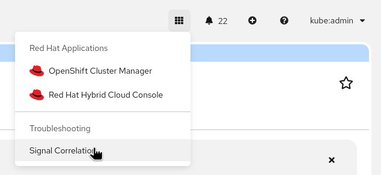
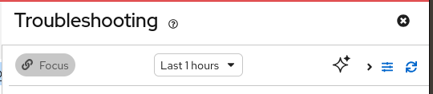
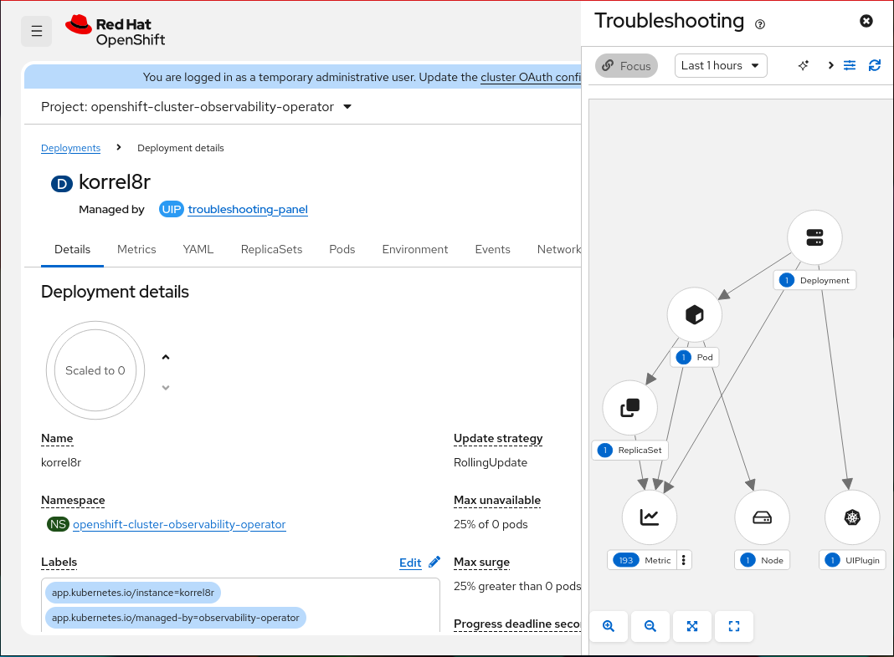
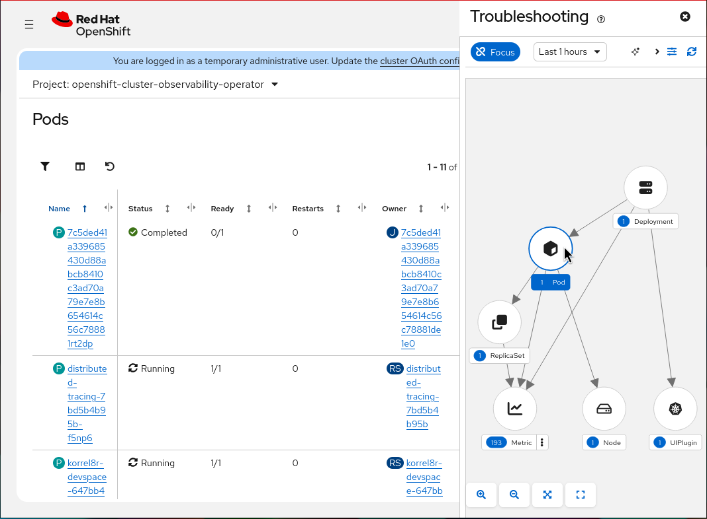
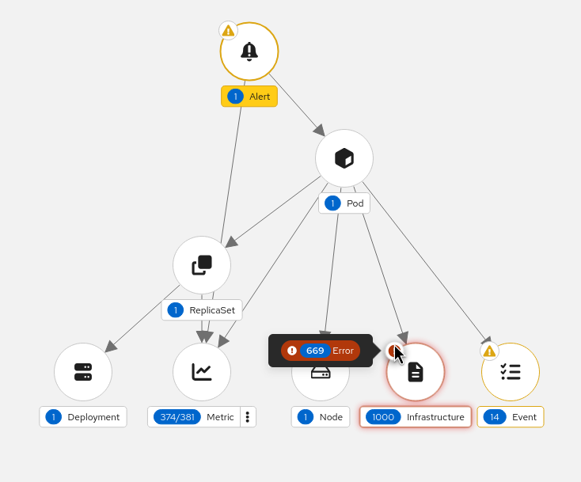
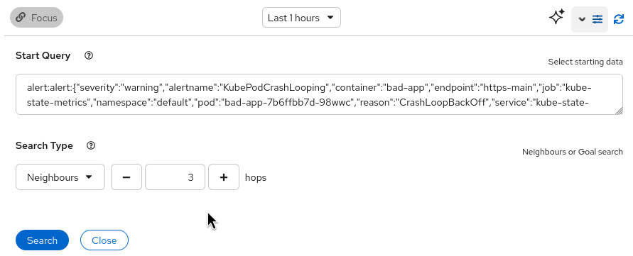
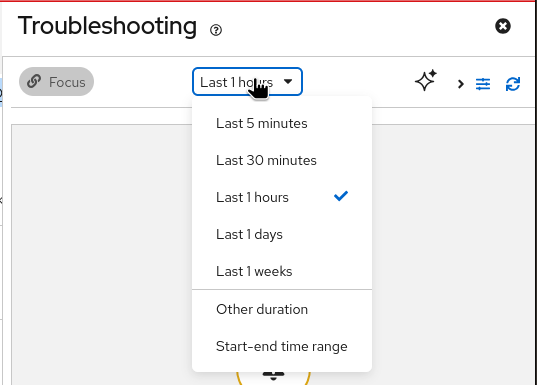
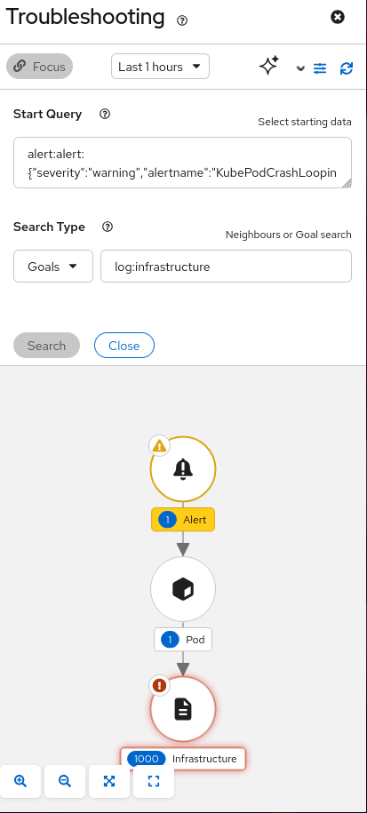

# Troubleshooting Panel User Guide

The troubleshooting panel helps you discover and navigate resources and observability signals related to what you are viewing in the OpenShift Console. It uses [Korrel8r](https://korrel8r.github.io/korrel8r/) to find correlations between alerts, pods, events, logs, metrics, network flows, traces and other cluster data.

## Prerequisites

The troubleshooting panel requires the [Cluster Observability Operator](https://docs.openshift.com/container-platform/latest/observability/cluster_observability_operator/cluster-observability-operator-overview.html) (COO) and a `UIPlugin` resource of type `TroubleshootingPanel`:

```yaml
apiVersion: observability.openshift.io/v1alpha1
kind: UIPlugin
metadata:
  name: troubleshooting-panel
spec:
  type: TroubleshootingPanel
```

The COO deploys Korrel8r and the troubleshooting panel plugin.

## Opening the panel

Open the application grid menu in the console masthead and select **Signal Correlation** under **Troubleshooting**.



The panel opens on the right side of the console, automatically focused on what you are viewing.

> [!NOTE]
> Some pages don't support correlation, for example the _Overview_ page. The panel will show `No results`.
> Use the `Correlate` button to correlate from a more interesting page.

## Correlate



The `Correlate` button resets the correlation to start from whatever is currently displayed in the main console view.
You can follow lines and perform searches in the main view as usual, and click `Correlate` at any time to see correlated data.

- When the panel already matches the current view, the button is disabled.
- When you have navigated away, click it to correlate from the new view.

## The correlation graph

When the panel opens it performs a **neighbourhood search** from what you are viewing.
This finds all correlated signals within a configurable number of hops (default: 3).

The results are shown as a directed graph:



- Each **node** represents a class of related data (e.g. Alert, Pod, Event, Logs, Metric, Network).
- The **label** below each node shows the class name.
- The **badge** on each node shows the count of matching items. If a node has multiple queries, it shows _selected/total_ (e.g. `5/10`).
- The **edges** (arrows) show the direction of correlation rules followed between classes.

**Click any node** to navigate the main console view to that data. The panel stays open while you navigate.



## Multiple queries per node

A node may represent several queries. Clicking a node navigates to the _first_ query.
When a node has multiple queries, the badge shows a fraction like `5/10` and a `⋮` menu.
Right-click or open the menu to see each query with its own count and status breakdown.

Each menu item shows:

- **Badge**: number of matching objects.
- **Query selector**: identifies the data.
- **Status labels**: counts of Error, Warning or Info objects, if any.

Clicking a menu item navigates to that view and copies the query to your clipboard.

## Status markers

Nodes can display **status markers** indicating severity:



- **Error** (red): Probably requires action.
- **Warning** (yellow): May require action if unattended.
- **Info** (purple): Usually does not require action, but may be of interest.

Hover over a marker to see a breakdown of status counts.

## Search settings

Click the **sliders icon** in the toolbar to open the advanced search form.



### Start query

Shows the current starting query in `domain:class:selector` format. **Correlate** fills this automatically from the current view, or you can type a query manually.

### Search type

- **Neighbours**: Find all connected data up to a maximum **depth** (1-10 hops, default 3). Larger depth finds more data but takes longer.
- **Goals**: Find paths to a specific **goal class** (e.g. `trace:span`). Faster than neighbourhood search because it only follows paths to the target.

### Time range

The **time range dropdown** controls the search time window:



- Last 5 minutes, 30 minutes, 1 hour (default), 1 day, or 1 week
- **Custom duration**: specify a count and unit (minutes, hours, days, weeks).
- **Custom time range**: pick specific start and end dates/times.

### AI agent navigation

The AI button is only available if you have enabled the [dev preview AI agent navigation feature](agent-navigation.md).

### Refresh and cancel

- **Refresh** (circular arrows icon): re-run the current search.
- **Cancel**: appears while a search is running to interrupt it.

## Goal-directed searches

Find paths to a specific type of related data, without a full neighbourhood search:

1. Open the advanced search form.
2. Change the search type to **Goals**.
3. Enter the goal class, e.g. `trace:span`.
4. Click **Search**.



The graph shows only paths from your starting point to the goal class.

Common goal classes:

| Goal | Description |
|------|-------------|
| `alert:alert` | Alerts |
| `k8s:Pod.v1.` | Pods |
| `k8s:Event.v1.` | Kubernetes events |
| `log:infrastructure` | Infrastructure logs |
| `log:application` | Application logs |
| `metric:metric` | Metrics |
| `netflow:network` | Network flows |
| `trace:span` | Trace spans |


